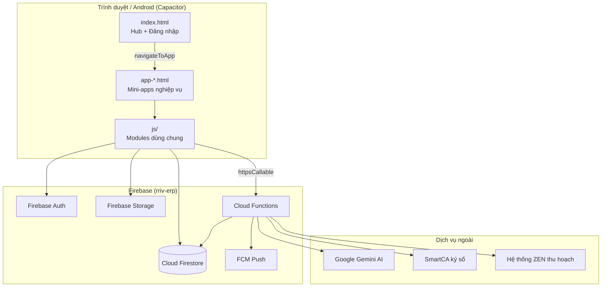
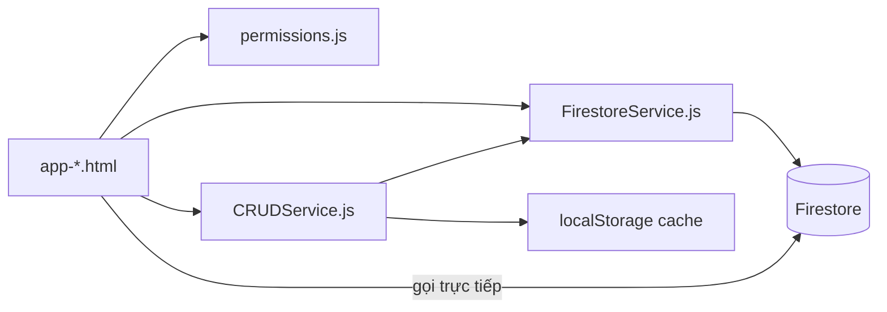
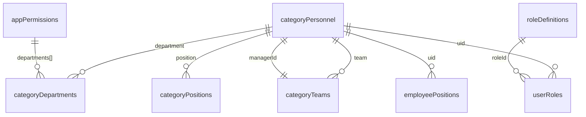
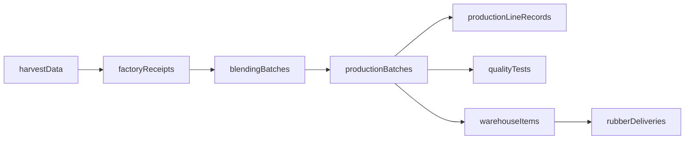

# Cấu trúc Cơ sở dữ liệu & Cơ chế hoạt động — ERP RRIV

> Kiến trúc Phước Hòa, triển khai bằng **Flask + Supabase** (không Firebase)  
> Cập nhật: 11/06/2026

## 1. Tổng quan RRIV

| Thành phần | Công nghệ |
|------------|-----------|
| Frontend | HTML / CSS / JavaScript (vanilla), mini-app trong `templates/` |
| Hub | `index.html` — đăng nhập + launcher |
| Backend | **Flask** (`app.py`) |
| Cơ sở dữ liệu | **Supabase PostgreSQL** |
| Xác thực | Flask API + `user_login_view` + session `localStorage` |
| File đính kèm | Supabase Storage *(bước sau)* |
| Push / FCM | Chưa triển khai (stub) |

### So sánh với Phước Hòa

| Phước Hòa | RRIV |
|-----------|------|
| Cloud Firestore | `erp_collections` (JSONB) + bảng master SQL |
| Firebase Auth | `/api/login-password`, `/api/request-otp` |
| Cloud Functions | `/api/functions/<tên>` (Flask, mở rộng dần) |
| `firebase.firestore()` | **`ErpDb.firestore()`** → Flask `/api/data/*` → Supabase |
| `FirestoreService` | `SupabaseService` (alias `FirestoreService`) |

## 2. Sơ đồ kiến trúc RRIV

```mermaid
flowchart TB
    subgraph Client["Trình duyệt"]
        INDEX[index.html Hub]
        APPS[templates/*.html Mini-apps]
        JS[static/js/]
    end

    subgraph Flask["Flask app.py"]
        AUTH_API[/api/login-* /api/profile]
        DATA_API[/api/data/collection]
        FN_API[/api/functions/]
    end

    subgraph Supabase["Supabase PostgreSQL"]
        MASTER[category_personnel, departments...]
        ERP[(erp_collections)]
        LOGIN[user_login_view]
    end

    INDEX --> APPS
    APPS --> JS
    JS --> AUTH_API
    JS --> DATA_API
    AUTH_API --> LOGIN
    DATA_API --> ERP
    DATA_API --> MASTER
```

## 3. Cấu trúc thư mục

```
RRIV-ERP/
├── app.py                          # Flask: UI + API
├── supabase/schema.sql             # Schema PostgreSQL
├── requirements.txt
├── scripts/migrate_rriv_architecture.py
├── templates/
│   ├── index.html                  # Hub đăng nhập
│   ├── includes/rriv_core.html     # Script lõi (nạp vào mọi app)
│   ├── app_shell.html              # Placeholder app chưa có file
│   ├── vanphongpham.html, sanxuat.html, vuoncay.html, ...
├── static/
│   ├── js/
│   │   ├── services/
│   │   │   ├── SupabaseService.js  # Gọi /api/data/*
│   │   │   ├── ErpDb.js            # API kiểu collection/doc (thay firebase)
│   │   │   ├── FirestoreService.js # Alias SupabaseService
│   │   │   └── CRUDService.js      # Load/save + cache
│   │   ├── modules/auth.js         # Session RRIV
│   │   ├── utils/config.js, permissions.js
│   │   ├── sanxuat/, giaoviec/, ... # Module nghiệp vụ
│   └── css/
```

## 4. Luồng dữ liệu

```
App HTML → ErpDb.firestore().collection('vpp_orders').get()
         → FirestoreService.getDocs()
         → SupabaseService → fetch('/api/data/vpp_orders/query')
         → app.py → supabase.table('erp_collections')
```

**Collection master** (map bảng SQL): `categoryPersonnel`, `categoryDepartments`, … — xem `TABLE_MAP` trong `app.py`.

## 5. Map URL mini-app

| URL | Template |
|-----|----------|
| `/app/vanphongpham` | `vanphongpham.html` |
| `/app/dieuhanhxe` | `dieuxe.html` |
| `/app/vanbannoibo` | `vanbannoibo.html` |
| `/app/nhansu` | `nhansu.html` |
| `/app/sanxuat` | `sanxuat.html` |
| `/app/vuoncay` | `vuoncay.html` |
| `/app/phanquyen` | `phanquyen.html` |
| `/app/doanhnghiep` | `app_shell.html` *(chưa có file)* |

Mọi template app cần có `` ngay sau `<head>`.

## 6. Triển khai

```bash
pip install -r requirements.txt
# Chạy supabase/schema.sql trên Supabase Dashboard
python app.py
```

Truy cập: `http://localhost:5000`

---

# Tham chiếu gốc — ERP Phước Hòa (Firebase)

> Tài liệu tổng hợp từ rà soát mã nguồn dự án `quantridoanhnghiep`  
> Firebase project: **rriv-erp** | Hosting: `rriv-erp.web.app`, `vanbannoibo.phr.vn`

---

## 1. Tổng quan hệ thống

Hệ thống Quản Trị Doanh Nghiệp RRIV là **ứng dụng web đa trang (multi-page)** triển khai trên **Firebase**, không dùng SQL hay Google Apps Script.

| Thành phần | Công nghệ |
|------------|-----------|
| Frontend | HTML / CSS / JavaScript thuần (vanilla JS) |
| Cơ sở dữ liệu | **Cloud Firestore** (NoSQL, collection/document) |
| Xác thực | Firebase Authentication |
| Backend serverless | Firebase Cloud Functions (Node.js 20) |
| Lưu trữ file | Firebase Storage |
| Hosting | Firebase Hosting |
| Mobile | Capacitor 5 (Android) + PWA |
| Import/Export Excel | SheetJS (XLSX) qua CDN |

**Đặc điểm kiến trúc:**
- Mỗi nghiệp vụ là một **mini-app** (`app-*.html`) mở từ trang hub `index.html`.
- Dữ liệu dùng chung qua các collection master (`categoryPersonnel`, `categoryDepartments`, …).
- Hai phong cách code song song: app cũ (JS inline trong HTML) và app mới (module trong `js/`).
- Không có file `.sql` — schema ngầm định qua `firestore.rules` và cách dùng trong code.

---

## 2. Sơ đồ kiến trúc tổng thể



---

## 3. Luồng hoạt động chính

### 3.1. Đăng nhập và phiên làm việc

```
Người dùng → index.html
    → Firebase Auth (email = username@phr.vn)
    → Đọc hồ sơ từ categoryPersonnel (doc ID = Firebase UID)
    → Lưu localStorage: currentUser, qtdn_user, userProfile
    → Hiển thị thẻ ứng dụng theo quyền (appPermissions, roleDefinitions)
```

- Module `js/modules/auth.js`: quản lý đăng nhập, session 8 giờ, load profile.
- `js/utils/permissions.js`: kiểm tra quyền đa ứng dụng (RBAC).
- `firestore.rules`: enforce quyền đọc/ghi theo role, department, team.

### 3.2. Điều hướng giữa các ứng dụng

Hàm `navigateToApp(appId)` trong `index.html` map `appId` → file HTML:

| appId | File | Nghiệp vụ |
|-------|------|-----------|
| `vanphongpham` | `app-vpp.html` | Văn phòng phẩm |
| `baocao` | `app-baocao.html` | Báo cáo |
| `dieuxe` | `app-dieuxe.html` | Điều xe |
| `vanban` | `app-vanban.html` | Văn bản nội bộ |
| `nhansu` | `app-nhansu.html` | Quản lý nhân sự |
| `dautuxdcb` | `app-dautuxdcb.html` | Đầu tư xây dựng cơ bản |
| `diemdanh` | `app-diemdanh.html` | Điểm danh / GPS |
| `vuoncay` | `app-vuoncay.html` | Vườn cây |
| `sanxuat` | `app-sanxuat.html` | Sản xuất |
| `chatluong` | `app-chatluong.html` | Chất lượng ISO |
| `thoitiet` | `app-thoitiet.html` | Thời tiết |
| `bctm` | `app-bctm.html` | Báo cáo tổng tiến |
| `thongbao` | `app-thongbao.html` | Thông báo (admin) |
| `admin-roles` | `app-admin-roles.html` | Phân quyền |

**App có file nhưng chưa gắn vào hub:**
- `app-giaoviec.html` — Giao việc & KPI (truy cập trực tiếp URL hoặc PWA shortcut)
- `app-kiemsoatvanban.html` — Kiểm soát văn bản
- `app-danduong.html` — Dẫn đường

**Tiện ích khác:** `migrate-data.html`, `delete-gps-today.html`, `smartca-callback.html`, `offline.html`

### 3.3. Truy cập dữ liệu (pattern chung)



- **App mới** (sản xuất, giao việc): load `FirestoreService` → `CRUDService` → module domain.
- **App cũ**: gọi `firebase.firestore()` trực tiếp trong inline script.
- **Backend**: trigger Firestore / HTTP callable từ `functions/index.js`.

### 3.4. Cơ chế module JavaScript

Không dùng ES `import/export`. Mỗi file là **IIFE** gán global:

| Global | File | Vai trò |
|--------|------|---------|
| `Config` | `js/utils/config.js` | Firebase config, API URL, cài đặt app |
| `Auth` | `js/modules/auth.js` | Đăng nhập, session |
| `API` | `js/modules/api.js` | Wrapper Cloud Functions |
| `Permissions` | `js/utils/permissions.js` | RBAC đa app |
| `FirestoreService` | `js/services/FirestoreService.js` | CRUD Firestore tập trung |
| `CRUDService` | `js/services/CRUDService.js` | Load/save có cache |
| `ExportService` | `js/services/ExportService.js` | Xuất Excel |

Thứ tự load script trong HTML quyết định phụ thuộc — file sau dùng global từ file trước.

---

## 4. Cấu trúc thư mục và liên kết file

```
quantridoanhnghiep/
├── index.html                 # Hub: login, launcher, navigateToApp()
├── app-*.html                 # Mini-app theo nghiệp vụ
├── firebase.json              # Deploy: hosting, firestore, functions, storage
├── firestore.rules            # Security rules + danh sách collection hợp lệ
├── storage.rules              # Quy tắc upload file
├── package.json               # npm scripts: deploy, test, cap
├── capacitor.config.json      # Android wrapper
├── manifest.json              # PWA
├── sw.js, sw-diemdanh.js      # Service workers
│
├── js/
│   ├── app.js                 # Hub module legacy (ít dùng)
│   ├── native-gps.js          # GPS Capacitor
│   ├── modules/               # auth, api, personnel, attendance, ui
│   ├── utils/                 # config, permissions, validation, security...
│   ├── services/              # FirestoreService, CRUDService, ExportService
│   ├── components/            # DataTable, ModalForm, StatsCards...
│   ├── sanxuat/               # Module sản xuất (config, services, tabs)
│   ├── giaoviec/              # Module giao việc/KPI
│   └── thumua/config/         # Config thu mua (chưa có app đầy đủ)
│
├── css/                       # base, components, dark-theme, app-*
├── functions/index.js         # Cloud Functions (~4800 dòng)
├── tests/                     # Jest unit/integration
├── scripts/                   # migrate-users.js, auth-production.js
├── www/                       # Bản sync cho Capacitor
└── android/                   # Project Android
```

### 4.1. Chuỗi phụ thuộc — App Sản xuất (mẫu module hóa)

```
Firebase SDK (CDN)
  → js/utils/permissions.js
  → js/services/FirestoreService.js
  → js/services/CRUDService.js
  → js/services/ExportService.js
  → js/components/* (DataTable, ModalForm, ...)
  → js/sanxuat/config/* (factories, stages, tccs-specs, params)
  → js/sanxuat/services/* (TCCSValidator, BatchProcessor, ...)
  → js/sanxuat/tabs/* (gardens, reception, mes, quality, warehouse, admin)
```

| Tab file | Collection chính sử dụng |
|----------|--------------------------|
| `gardens.js` | `rubberGardens`, `harvestData` |
| `reception.js` | `factoryReceipts`, `materialReceipts` |
| `mes.js` | `productionBatches`, `productionLineRecords`, `blendingBatches` |
| `quality.js` | `qualityTests` |
| `warehouse.js` | `warehouseItems`, `coagulumStorage`, `rubberDeliveries` |
| `admin.js` | `admin_tccs_overrides`, `shiftSchedules`, `ovenDailyOps` |

### 4.2. Chuỗi phụ thuộc — App Giao việc

```
Firebase SDK
  → js/utils/config.js
  → js/utils/permissions.js
  → js/giaoviec/config/constants.js, permissions.js
  → js/giaoviec/services/data-loader.js, task-crud.js, ...
  → js/giaoviec/tabs/* (mytasks, kanban, gantt, calendar, activity)
  → js/giaoviec/features/* (raci, dependencies, templates, drag-drop, archive-kpi)
```

---

## 5. Cơ sở dữ liệu Firestore

Firestore lưu dữ liệu dạng **collection / document**. Document ID thường là UUID hoặc Firebase Auth UID (với `categoryPersonnel`).

`firestore.rules` định nghĩa **100+ collection** được phép truy cập; collection không khai báo sẽ bị từ chối (deny-all).

### 5.1. Trung tâm dữ liệu dùng chung (Master Data)

Đây là “xương sống” liên kết mọi module:



#### `categoryPersonnel` (quan trọng nhất)

- **Document ID** = Firebase Auth UID
- **Vai trò:** hồ sơ nhân sự + profile đăng nhập
- **Trường chính** (từ code & rules): `hoTen`, `username`, `phone`, `department`, `position`, `team`, `role`, `disabled`, `appRolesCache`, `accountLocked`, `lockUntil`, `status`
- **Liên kết:** mọi app tham chiếu qua `uid`, `assignedTo.uid`, `createdBy.uid`, `managerId`

#### Các collection master khác

| Collection | Mô tả | Trường điển hình |
|------------|-------|------------------|
| `categoryDepartments` | Phòng ban | `name`, `ten`, `tenPhongBan` |
| `categoryPositions` | Chức danh | `name` |
| `categoryTeams` | Tổ/đội | `name`, `department`, `managerId` |
| `categoryFactories` | Nhà máy | — |
| `categoryUnits` | Đơn vị (BCTM) | `tenDonVi` |
| `employeePositions` | Kiêm nhiệm | `positionId`, tham chiếu user |
| `appPermissions` | Quyền truy cập app theo phòng ban | `allowAll`, `departments[]` |
| `roleDefinitions` | Định nghĩa role | permissions theo app |
| `userRoles` | Gán role cho user | — |
| `positionRoles` | Gán role theo chức danh | — |
| `users` | User legacy | — |

### 5.2. Phân nhóm collection theo nghiệp vụ

#### A. Văn phòng phẩm (VPP)

| Collection | Mô tả |
|------------|-------|
| `vpp_products`, `vppProducts`, `products` | Danh mục sản phẩm |
| `vpp_orders`, `vppRequests`, `vpp_requests` | Đơn hàng / yêu cầu |
| `vpp_sessions` | Phiên đặt hàng |
| `vpp_templates` | Mẫu đơn |
| `vpp_quotas` | Hạn mức |
| `vpp_sla_config` | Cấu hình SLA |
| `vpp_notification_queue` | Hàng đợi thông báo |
| `vpp_subscriptions` | Đăng ký nhận thông báo |
| `vpp_departments` | Phòng ban VPP |

**Cloud Functions liên quan:** `processVppNotificationQueue`, `sendVppDeadlineReminders`

#### B. Điều xe

| Collection | Mô tả |
|------------|-------|
| `dieuxe_requests` | Yêu cầu điều xe |
| `dieuxe_vehicles` | Danh sách xe |
| `dieuxe_employee_groups` | Nhóm nhân viên |
| `dieuxe_maintenance` | Bảo dưỡng |
| `dieuxe_templates` | Mẫu yêu cầu |

#### C. Văn bản nội bộ

| Collection | Mô tả |
|------------|-------|
| `vanban_documents` | Văn bản chính |
| `vanban_documents/{id}/comments` | Bình luận (subcollection) |
| `vanban_documents/{id}/versions` | Phiên bản (subcollection) |
| `vanban_templates` | Mẫu văn bản |
| `vanban_workflows` | Quy trình duyệt |
| `vanban_delegations` | Ủy quyền |
| `vanban_phieu_chuyen` | Phiếu chuyển |
| `vanban_phieu_chuyen/{id}/xu_ly` | Xử lý phiếu chuyển |
| `vanban_tags` | Thẻ tag |
| `vanban_audit_logs` | Nhật ký audit |
| `vanban_counters` | Bộ đếm số văn bản |
| `vanban_nhansu`, `vanban_donvi`, `vanban_chucvu` | Danh mục phụ |
| `smartca_sessions` | Phiên ký số SmartCA |

**Cloud Functions:** `onVanbanDocumentCreate/Update`, `smartca*`, `generateDocumentContentWithGemini`, `aiCheckSpelling`

#### D. Điểm danh & GPS

| Collection | Mô tả |
|------------|-------|
| `diemdanh_employees` | Nhân viên điểm danh (khuôn mặt) |
| `diemdanh_checkins` | Lịch sử check-in |
| `diemdanh_patrols` | Tuần tra |
| `diemdanh_alerts` | Cảnh báo |
| `diemdanh_gps` | Dữ liệu GPS điểm danh |
| `gps_locations` | Vị trí GPS realtime |
| `gps_work_zones` | Vùng làm việc |
| `gps_history` | Lịch sử GPS |
| `gps_alerts` | Cảnh báo GPS |
| `gps_settings` | Cài đặt |
| `security_gps_locations` | GPS an ninh |
| `user_fcm_tokens`, `fcm_tokens` | Token push notification |
| `push_notifications` | Thông báo đẩy |

**File liên quan:** `js/native-gps.js`, `sw-diemdanh.js`

#### E. Sản xuất cao su

| Collection | Mô tả |
|------------|-------|
| `rubberGardens` | Vườn cây / lô |
| `harvestData`, `HarvestData` | Dữ liệu thu hoạch |
| `factoryReceipts` | Tiếp nhận tại nhà máy |
| `materialReceipts` | Tiếp nhận nguyên liệu |
| `blendingBatches` | Lô phối trộn |
| `productionBatches` | Lô sản xuất |
| `productionLineRecords` | Ghi nhận dây chuyền |
| `coagulumStorage` | Kho đông tụ |
| `rubberDeliveries` | Giao hàng |
| `warehouseItems` | Tồn kho |
| `qualityTests` | Kiểm tra chất lượng (SX) |
| `shiftSchedules` | Lịch ca |
| `ovenDailyOps` | Vận hành lò |
| `miscStorageLogs`, `miscCompartments` | Kho phụ |
| `admin_tccs_overrides` | Ghi đè thông số TCCS |
| `zen_sync_logs` | Log đồng bộ ZEN |

**Luồng dữ liệu sản xuất:**



**Trường `productionBatches` (từ `js/sanxuat/tabs/mes.js`):**
`batchNo`, `date`, `product`, `processStage`, `inputWeight`, `outputWeight`, `status`, `notes`, `techParams`, `sourceTankId`, `factory`, `lineGroup`, `stageData`, `timeline[]`

**Cloud Functions:** `fetchZenHarvestData`, `syncZenHarvestData`, `autoSyncZenHarvestData`, `syncHistoricalZenDataDaily`

#### F. Chất lượng ISO (mở rộng)

| Collection | Mô tả |
|------------|-------|
| `qualityTestsSVR`, `qualityTestsLatex` | Kết quả thử nghiệm |
| `qualitySamples`, `qualityLatexSamples` | Mẫu thử |
| `qualityEquipment` | Thiết bị |
| `equipCalibrationList`, `equipCalibSchedule` | Hiệu chuẩn |
| `equipPhieuKT`, `equipPhieuBT`, `equipPhieuGKHC` | Phiếu KT/BT/GKHC |
| `equipLyLich` | Lý lịch thiết bị |
| `qualityCertRegisterSVR`, `qualityCertRegisterLatex` | Sổ chứng nhận |
| `qualityShippingOrders` | Lệnh xuất hàng |
| `qualityRoleAssignments` | Phân quyền CL |
| `qualityFormTemplates`, `qualitySampleQtySettings` | Mẫu biểu |
| `materialSourceSettings` | Nguồn nguyên liệu |
| `dm_thanhpham`, `dm_nguyenlieu`, `dm_nhomhang`, `dm_donvitinh` | Danh mục |
| `categoryProducts`, `baleTypes`, `wrapTypes`, `palletTypes` | Loại bao/bọc/pallet |

#### G. Giao việc & KPI

| Collection | Mô tả |
|------------|-------|
| `workTasks` | Công việc |
| `kpiEvaluations` | Đánh giá KPI |
| `taskTemplates` | Mẫu công việc |
| `sprints` | Sprint |
| `notifications`, `user_notifications` | Thông báo |
| `appConfig` | Cấu hình app |

**Trường `workTasks` (từ `js/giaoviec/tabs/kanban.js`):**
`title`, `description`, `priority` (P1/P2/P3), `status`, `assignedDept`, `supportDepts`, `assignedTo{uid,name}`, `approvedBy`, `dueDate`, `progress`, `comments[]`, `parentTaskId`, `sourceType`, `tags[]`, `dependencies[]`, `recurring`, `estimatedDays`, `subtasks[]`, `createdBy{uid,name}`, `createdAt`, `updatedAt`

**Liên kết:**
- `assignedTo.uid` → `categoryPersonnel`
- `assignedDept` → `categoryDepartments`
- Hoàn thành task → trigger `notifications`, `kpiEvaluations`

#### H. Báo cáo tổng tiến (BCTM)

| Collection | Mô tả |
|------------|-------|
| `bctm_daily` | Báo cáo ngày |
| `bctm_monthly` | Báo cáo tháng |
| `bctm_data` | Dữ liệu tổng hợp |
| `bctm_reports` | Báo cáo |
| `bctm_plan`, `bctm_plans` | Kế hoạch |
| `bctm_units` | Đơn vị |
| `daily_finished_products` | Sản phẩm hoàn thành ngày |

#### I. Vườn cây & Thu hoạch

| Collection | Mô tả |
|------------|-------|
| `harvestPlans` | Kế hoạch thu hoạch |
| `harvestProduction` | Sản lượng thu hoạch |
| `RubberLots` | Lô cao su |
| `ProductionPlace` | Nơi sản xuất |
| `quiTraData` | Dữ liệu quỹ trả |
| `rubber_prices` | Giá cao su |
| `garden_alerts` | Cảnh báo vườn |

**Cloud Functions:** `onGardenAlert`, `onGardenAlertUpdate`

#### J. Thời tiết

| Collection | Mô tả |
|------------|-------|
| `weather_locations` | Điểm quan trắc |
| `weather_cache` | Cache dữ liệu |
| `weather_alerts` | Cảnh báo |
| `weather_observations`, `weather_readings` | Quan trắc |
| `weather_settings` | Cài đặt |
| `weather_ml` | Dữ liệu ML |
| `flood_drought_daily` | Lũ/hạn hàng ngày |

**Cloud Functions:** `analyzeFloodDroughtWithGemini`, `analyzeImageWithGemini`

#### K. Đầu tư xây dựng cơ bản

| Collection | Mô tả |
|------------|-------|
| `investment_projects` | Dự án |
| `project_work_items` | Hạng mục công việc |
| `project_diary` | Nhật ký thi công |
| `weeklyTasks` | Công việc tuần |

#### L. Cân sản lượng / Thu mua (đang chuẩn bị)

| Collection | Mô tả |
|------------|-------|
| `cansanluong_workers` | Công nhân |
| `cansanluong_donvi` | Đơn vị |
| `cansanluong_doi` | Đội |
| `cansanluong_to` | Tổ |
| `cansanluong_lo` | Lô |
| `cansanluong_phancao` | Phân cao |
| `cansanluong_phiencao` | Phiên cạo |
| `cansanluong_weighings` | Phiếu cân |
| `cansanluong_config` | Cấu hình |

**Config:** `js/thumua/config/thumua-config.js` (chưa có `app-thumua.html` đầy đủ)

#### M. Nhân sự & Nghỉ phép

| Collection | Mô tả |
|------------|-------|
| `leave_requests` | Đơn nghỉ phép |
| `leave_balances` | Số ngày phép |
| `leave_policies` | Chính sách nghỉ |
| `employees` | Nhân viên (legacy) |

#### N. Hệ thống & Bảo mật

| Collection | Mô tả |
|------------|-------|
| `system_settings`, `app_settings`, `appSettings` | Cài đặt hệ thống |
| `auditLogs`, `audit_log`, `permissionAuditLogs` | Nhật ký |
| `login_history` | Lịch sử đăng nhập |
| `user_sessions`, `sessions` | Phiên |
| `permissionRequests` | Yêu cầu quyền |
| `permissionDelegations`, `temporaryPermissions` | Ủy quyền tạm |
| `roleTemplates` | Mẫu role |
| `organizationalAssignments` | Phân công tổ chức |
| `thongbao` | Thông báo nội bộ |
| `_trash` | Thùng rác (soft delete) |
| `sharedRoutes` | Route chia sẻ |
| `userSettings` | Cài đặt user |

---

## 6. Firebase Storage (file đính kèm)

Định nghĩa trong `storage.rules`:

| Đường dẫn | Mục đích | Giới hạn |
|-----------|----------|----------|
| `checkin_evidence/`, `checkins/`, `patrol_evidence/` | Ảnh điểm danh | 10 MB, image/* |
| `faces/{userId}/`, `face_enrollments/` | Nhận diện khuôn mặt | 5 MB |
| `profiles/{userId}/` | Ảnh đại diện | 5 MB |
| `uploads/**` | Upload chung | 20 MB |
| `vpp_products/` | Ảnh sản phẩm VPP | 5 MB |
| `documents/` | Tài liệu văn bản | (xem rules) |

---

## 7. Cloud Functions (`functions/index.js`)

Backend xử lý logic không nên chạy trên client:

| Nhóm | Functions | Trigger |
|------|-----------|---------|
| Push notification | `onStrangerAlert`, `onGardenAlert`, `sendPush`, `sendPushNotification`, `sendScheduledReminders` | Firestore / Callable / Cron |
| VPP | `processVppNotificationQueue`, `sendVppDeadlineReminders` | Firestore / Cron |
| Bảo mật | `assignUserRoleHttp`, `removeUserRoleHttp`, `checkAccountLockHttp`, `checkDeviceTrustHttp`, `trustDeviceHttp` | HTTP |
| AI (Gemini) | `analyzeImageWithGemini`, `analyzeFloodDroughtWithGemini`, `generateDocumentContentWithGemini`, `aiCheckSpelling` | Callable / HTTP |
| SmartCA | `smartcaGetAuthUrl`, `smartcaSignDocument`, `smartcaWebhook`, `smartcaSp769*` | Callable / HTTP |
| Văn bản | `onVanbanDocumentCreate`, `onVanbanDocumentUpdate` | Firestore trigger |
| ZEN sync | `fetchZenHarvestData`, `syncZenHarvestData`, `autoSyncZenHarvestData` | Callable / Cron |

---

## 8. Bản đồ App → File → Collection

| App HTML | Thư mục JS chính | Collections Firestore chính |
|----------|------------------|----------------------------|
| `index.html` | inline + `js/modules/*` | `categoryPersonnel`, `appPermissions`, `roleDefinitions` |
| `app-vpp.html` | inline | `vpp_*` |
| `app-dieuxe.html` | inline | `dieuxe_*` |
| `app-vanban.html` | inline | `vanban_*`, `smartca_sessions` |
| `app-diemdanh.html` | `native-gps.js` | `diemdanh_*`, `gps_*`, `fcm_tokens` |
| `app-sanxuat.html` | `js/sanxuat/**` | `rubberGardens`, `productionBatches`, `factoryReceipts`, … |
| `app-chatluong.html` | inline + components | `qualityTests*`, `equip*`, `dm_*` |
| `app-giaoviec.html` | `js/giaoviec/**` | `workTasks`, `kpiEvaluations`, `taskTemplates` |
| `app-vuoncay.html` | inline | `harvestPlans`, `RubberLots`, `garden_alerts` |
| `app-bctm.html` | inline | `bctm_*`, `categoryUnits` |
| `app-thoitiet.html` | inline | `weather_*`, `flood_drought_daily` |
| `app-dautuxdcb.html` | inline | `investment_projects`, `project_*` |
| `app-nhansu.html` | `js/nhansu/**` ⚠️ | `categoryPersonnel`, `leave_*` |
| `app-admin-roles.html` | inline | `roleDefinitions`, `userRoles`, `positionRoles` |

---

## 9. Cấu hình & Triển khai

| File | Vai trò |
|------|---------|
| `firebase.json` | Hosting (public `.`), Firestore rules, Functions Node 20 |
| `.firebaserc` | Project alias `rriv-erp` |
| `js/utils/config.js` | Firebase API key, URL Cloud Functions, session timeout |
| `capacitor.config.json` | App ID Android: `com.vrgphuochoa.quantridoanhnghiep` |
| `package.json` | `npm run deploy`, `serve`, `test`, `cap:sync` |
| `scripts/migrate-users.js` | Tạo Auth user từ `categoryPersonnel` |
| `migrate-data.html` | Công cụ migrate từ Firebase cũ |

**Lệnh triển khai thường dùng:**
```bash
npm run deploy              # Deploy toàn bộ
npm run deploy:hosting      # Chỉ hosting
npm run deploy:functions    # Chỉ Cloud Functions
npm run serve               # Chạy local
npm run cap:sync            # Sync web → Android
```

---

## 10. Ghi chú quan trọng khi phát triển

### 10.1. Điểm cần lưu ý

1. **`js/nhansu/` chưa tồn tại** — `app-nhansu.html` tham chiếu folder này nhưng chưa có trong repo; HR có thể dùng `js/modules/personnel.js` qua hub cũ.
2. **Hai kiến trúc song song** — app cũ (inline JS hàng nghìn dòng) vs app mới (module `js/sanxuat/`, `js/giaoviec/`).
3. **Collection trùng tên khác convention** — ví dụ `harvestData` vs `HarvestData`, `vpp_products` vs `vppProducts` (legacy migration).
4. **`app-giaoviec.html` chưa có trong `navigateToApp()`** — chỉ truy cập URL trực tiếp hoặc PWA shortcut.
5. **Branding config** — `config.js` còn tham chiếu RRIV; `package.json`/manifest dùng Phước Hòa (`@phr.vn`).
6. **Không có README gốc** — tài liệu này là bản tổng hợp đầu tiên từ mã nguồn.

### 10.2. Nguyên tắc tham chiếu dữ liệu

- **User identity:** luôn dùng Firebase UID, đồng bộ với `categoryPersonnel` document ID.
- **Phân quyền:** kiểm tra cả client (`permissions.js`) và server (`firestore.rules`).
- **App mới:** ưu tiên `FirestoreService` thay vì gọi `db.collection()` trực tiếp.
- **Soft delete:** một số module dùng collection `_trash` thay vì xóa cứng.

### 10.3. Nguồn tham chiếu schema

Khi cần tra cứu chi tiết trường dữ liệu:

1. `firestore.rules` — danh sách collection hợp lệ + rule truy cập
2. File tab/service của module tương ứng trong `js/`
3. Inline script trong `app-*.html` (đối với app chưa module hóa)
4. `functions/index.js` — trigger và field được đọc/ghi ở backend

---

## 11. Tóm tắt

ERP Phước Hòa là **hệ sinh thái mini-app** dùng chung nền tảng Firebase, với **`categoryPersonnel`** làm trung tâm liên kết người dùng, phòng ban, tổ đội và phân quyền. Dữ liệu nghiệp vụ tách theo **prefix collection** (`vpp_`, `dieuxe_`, `vanban_`, `diemdanh_`, `bctm_`, `cansanluong_`, …) và các collection sản xuất (`productionBatches`, `qualityTests`, …). Luồng file: **`index.html` → `app-*.html` → `js/services/` + module domain → Firestore**, với Cloud Functions xử lý push, AI, ký số và đồng bộ ngoài.
